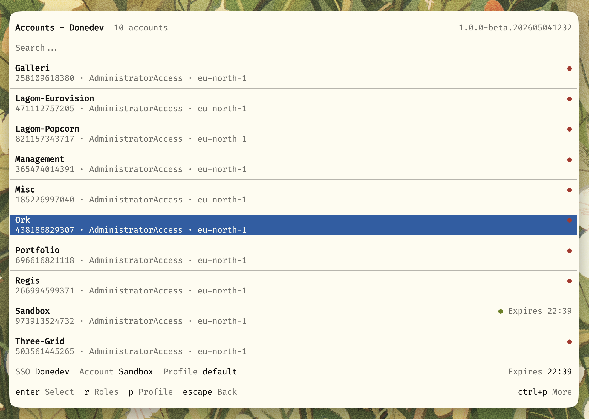
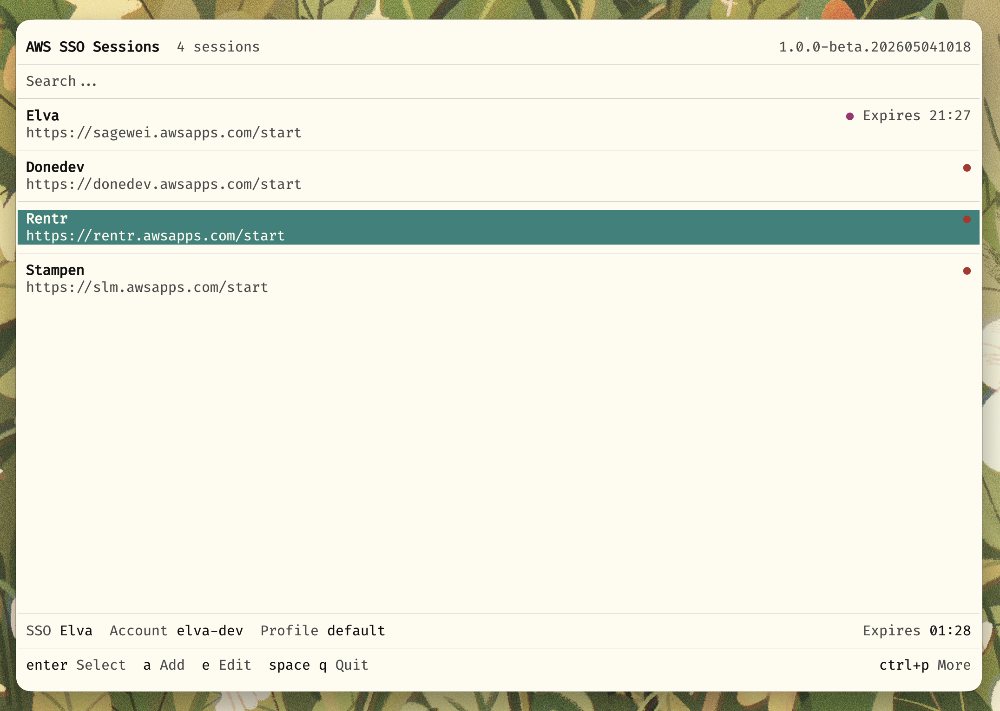
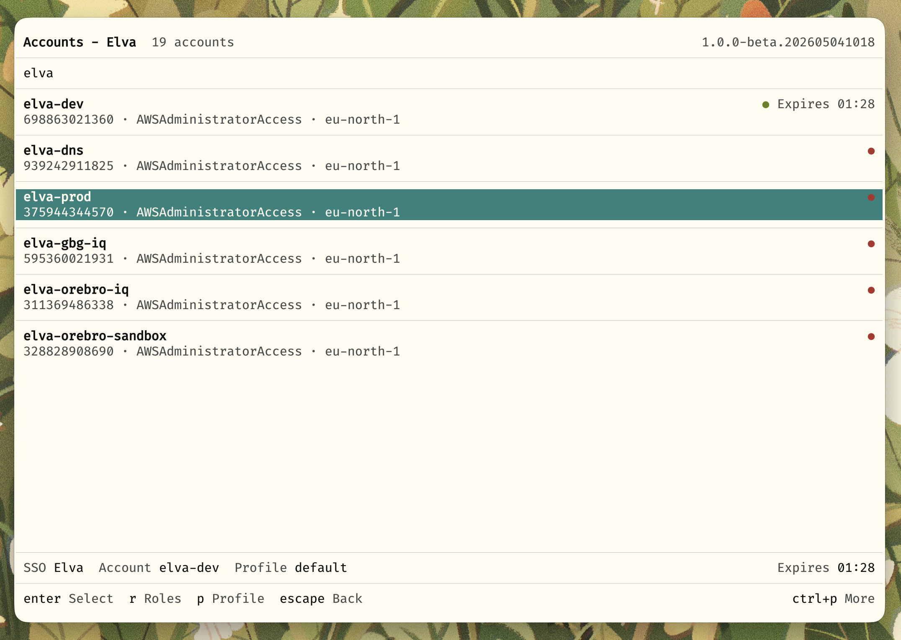
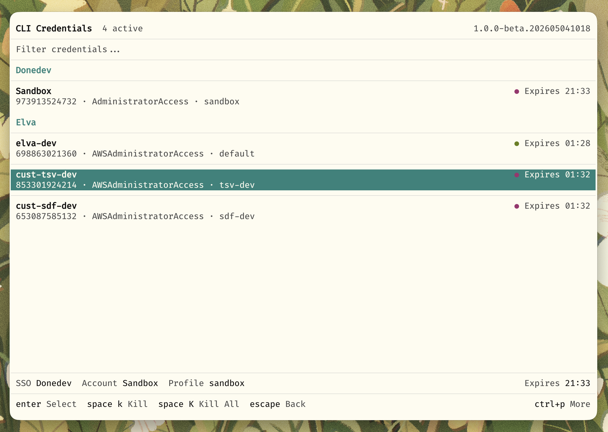

# awsesh

A modern AWS SSO session manager with an interactive TUI, powerful CLI, and a reusable SDK.


<!-- PLACEHOLDER: A wide banner image showing the awsesh TUI in a terminal. Show the main account selection screen with a few accounts listed, fuzzy search active, and the bottom action bar visible. Dark terminal theme preferred. Dimensions: ~1200x600px -->

## Features

- Interactive terminal UI for managing AWS SSO sessions
- Fast fuzzy search across accounts and roles
- Multiple SSO profile support
- Automatic credential management
- Browser integration for AWS Console access
- Shell integration with environment variable exports
- Reusable SDK for building your own tools
- XDG Base Directory compliant

## Installation

### Homebrew (macOS/Linux)

```sh
brew tap elva-labs/elva
brew install awsesh
```

**Beta version:**

```sh
brew tap elva-labs/elva
brew install awsesh-beta
```

### Pre-built Binaries

Download the latest release from the [Releases page](https://github.com/elva-labs/awsesh/releases/latest).

```sh
# Linux (x64)
curl -L https://github.com/elva-labs/awsesh/releases/latest/download/awsesh-linux-x64 -o awsesh
chmod +x awsesh
mv awsesh ~/.local/bin/

# macOS (Apple Silicon)
curl -L https://github.com/elva-labs/awsesh/releases/latest/download/awsesh-darwin-arm64 -o awsesh
chmod +x awsesh
mv awsesh /usr/local/bin/
```

### Build from Source

Requires [Bun](https://bun.sh) 1.3.1+

```sh
git clone https://github.com/elva-labs/awsesh.git
cd awsesh
bun install
bun run build
```

---

## Interactive TUI

Launch the interactive terminal interface:

```sh
awsesh
```


<!-- PLACEHOLDER: A GIF recording showing the full TUI flow: launching awsesh, selecting an SSO profile, searching for an account with fuzzy search, selecting a role, and seeing the "credentials set" confirmation. ~15-20 seconds. -->

### Navigation

| Key | Action |
|-----|--------|
| `j` / `k` or arrows | Navigate up/down |
| `Enter` | Select item |
| `Esc` / `Backspace` | Go back |
| `/` | Start fuzzy search |
| `Ctrl+P` | Open command palette |
| `?` | Show help |

### Managing SSO Profiles


<!-- PLACEHOLDER: Screenshot showing the SSO profile list with the action bar at the bottom showing available actions (n=new, e=edit, d=delete, o=open in browser). Show 2-3 example profiles. -->

| Key | Action |
|-----|--------|
| `n` | Add new SSO profile |
| `e` | Edit selected profile |
| `d` | Delete selected profile |
| `o` | Open SSO dashboard in browser |

### Account & Role Selection


<!-- PLACEHOLDER: Screenshot of the account list with fuzzy search active. Show the search input at top with a partial search term, filtered results below, and the match highlighting. Include the role count badge next to account names. -->

| Key | Action |
|-----|--------|
| `r` | Set custom region for account |
| `R` | Refresh account list |
| `b` | Open account in AWS Console |
| `p` | Set custom profile name |

### Active Sessions

View and manage your active credential sessions:


<!-- PLACEHOLDER: Screenshot of the active sessions page showing 2-3 active credentials with their profile names, account names, roles, and expiration times. Include the default session indicator. -->

---

## CLI

Use awsesh directly from the command line for scripting and automation.

### Quick Usage

```sh
# Set credentials for a specific role
awsesh <sso-profile> <account-name> <role-name>

# Use last selected role for an account
awsesh <sso-profile> <account-name>

# Check current identity
awsesh whoami

# List active sessions
awsesh sessions

# List cached accounts
awsesh accounts
```

### Commands

| Command | Description |
|---------|-------------|
| `awsesh` | Launch interactive TUI |
| `awsesh <sso> <account> [role]` | Set credentials directly |
| `awsesh whoami` | Show current AWS identity |
| `awsesh sessions` | List active credential sessions |
| `awsesh accounts` | List cached AWS accounts |
| `awsesh credentials` | List credentials in ~/.aws/credentials |
| `awsesh set <sso> <account> <role>` | Set credentials (explicit command) |
| `awsesh auth <sso>` | Authenticate with SSO |
| `awsesh migrate` | Migrate from old awsesh config |
| `awsesh open config` | Open config directory |
| `awsesh open data` | Open data directory |

### Options

```sh
awsesh [options] [sso] [account] [role]

Options:
  -e, --eval              Output environment variables for shell eval
  -b, --browser           Open AWS Console in browser
  -r, --region <region>   Override region for this session
  -p, --profile <name>    Use custom profile name
  -v, --version           Show version
  -h, --help              Show help
```

### Shell Integration

Add this to your shell config for seamless environment variable integration:

**Bash/Zsh:**
```bash
sesh() {
    eval "$(command awsesh --eval "$@")"
}
```

**Fish:**
```fish
function sesh
    eval (command awsesh --eval $argv)
end
```

This exports AWS environment variables directly to your shell:

```sh
sesh MyOrg MyAccount AdminRole
# Sets: AWS_PROFILE, AWS_REGION, AWS_ACCESS_KEY_ID, AWS_SECRET_ACCESS_KEY,
#       AWS_SESSION_TOKEN, AWS_SESSION_EXPIRATION
```

---

## SDK

The core functionality is available as a standalone SDK for building your own AWS SSO tools.

### Installation

```sh
npm install @awsesh/core
# or
bun add @awsesh/core
```

### Quick Start

```typescript
import { createAwsesh } from "@awsesh/core"

const awsesh = createAwsesh({
  configDir: "~/.config/awsesh",
  dataDir: "~/.local/share/awsesh", 
  awsDir: "~/.aws",
})

// List SSO sessions
const sessions = await awsesh.sessions.list()

// Start SSO login
const session = await awsesh.sessions.get("my-org")
const loginInfo = await awsesh.sso.startLogin(session)
console.log(`Open: ${loginInfo.verificationUriComplete}`)

// Poll for token
const token = await awsesh.sso.pollForToken(session, loginInfo)

// List accounts
const accounts = await awsesh.sso.listAccounts(session, token.token)

// Get credentials
const creds = await awsesh.sso.getCredentials(session, token.token, accountId, roleName)
```

See the full [SDK Documentation](packages/core/README.md) for detailed API reference.

For a complete working example, see the [awsesh-sdk-example](https://github.com/elva-labs/awsesh-sdk-example) repository.

---

## Migrating from Go Version

If upgrading from the original Go version of awsesh, run the migration command:

```sh
awsesh migrate
```

Options:
- `--dry-run` - Preview changes without applying
- `--force` - Force migration even if config exists
- `--no-backup` - Skip backup (not recommended)

The migration converts your existing profiles, tokens, and preferences to the new JSON format.

---

## Configuration

awsesh follows XDG Base Directory specification:

| Location | Purpose |
|----------|---------|
| `~/.config/awsesh/` | Configuration files |
| `~/.local/share/awsesh/` | Data storage (tokens, cache, preferences) |
| `~/.local/share/awsesh/logs/` | Log files |

### Settings

Access settings via `Ctrl+P` > Settings in the TUI, or edit `~/.config/awsesh/config.json`:

```json
{
  "theme": "dark",
  "logLevel": "info"
}
```

---

## License

MIT - see [LICENSE](LICENSE) for details.
