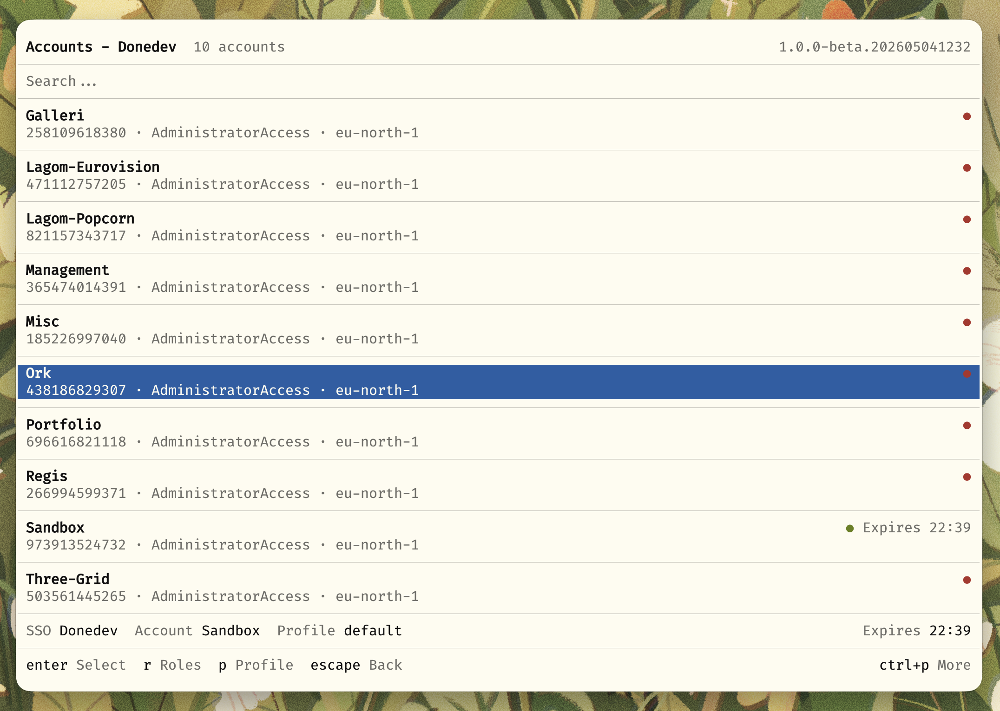
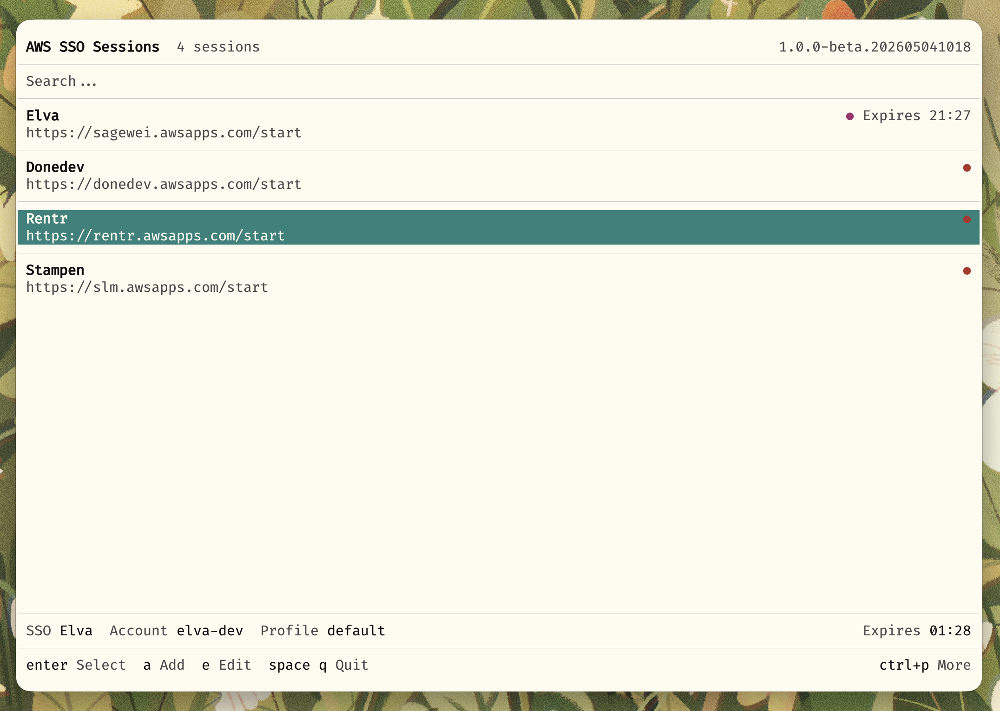
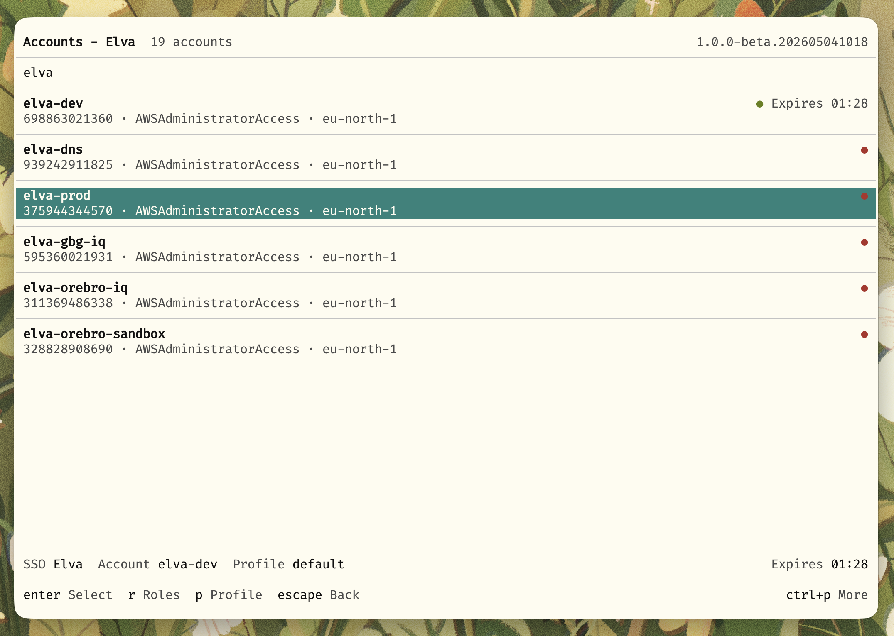
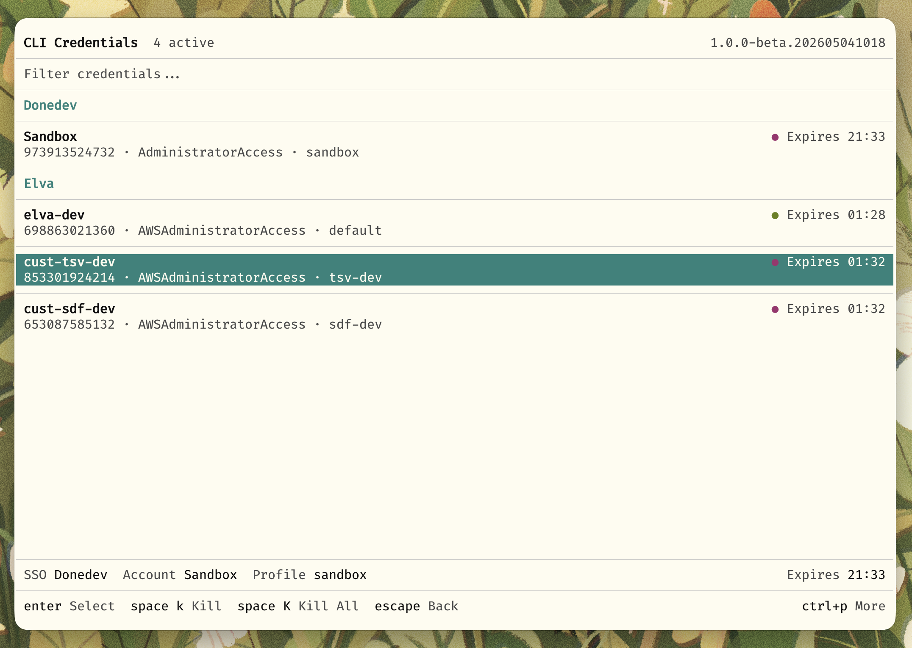

# awsesh

A modern AWS SSO session manager with an interactive TUI, powerful CLI, and a reusable SDK.



## Features

- Interactive terminal UI for managing AWS SSO sessions
- Interactive CLI if that's more your jam
- Fast fuzzy search across accounts and roles
- Multiple SSO profile support
- Automatic credential management
- Remappable keybindings
- Browser integration for quick AWS Console access
- Shell integration with environment variable exports
- Reusable SDK for building your own tools
- XDG Base Directory compliant

## Installation

### Homebrew (macOS/Linux)

```sh
brew tap elva-labs/elva
brew install awsesh
```

### Pre-built Binaries

Download the latest release from the [Releases page](https://github.com/elva-labs/awsesh/releases/latest).

```sh
# Linux (x64)
mkdir -p ~/.local/bin
curl -fL https://github.com/elva-labs/awsesh/releases/latest/download/awsesh-linux-x64.tar.gz | tar -xz -C ~/.local/bin
chmod +x ~/.local/bin/awsesh

# macOS (Apple Silicon)
mkdir -p ~/.local/bin
curl -fL https://github.com/elva-labs/awsesh/releases/latest/download/awsesh-darwin-arm64.zip -o /tmp/awsesh.zip
unzip -o /tmp/awsesh.zip -d ~/.local/bin
chmod +x ~/.local/bin/awsesh
rm /tmp/awsesh.zip
```

### Build from Source

Requires [Bun](https://bun.sh) 1.3.1+

```sh
git clone https://github.com/elva-labs/awsesh.git
cd awsesh
bun install
bun run build
```

## Releases

Merging into `main` runs CI and updates an unpublished **Release Drafter** draft with merged PRs and contributor links. It does not publish software. Conventional PR titles (`feat:`, `fix:`, and breaking changes) suggest a version; maintainers choose the actual version in a reviewed PR. Beta is a release channel, not an automatic release from the `beta` branch.

### Maintainer release process

1. From `main`, create a version branch and run `bun run release:prepare 1.1.0` (or `1.1.0-beta.1`). This updates the root/workspace manifests and `bun.lock`, without committing, tagging, pushing, or publishing. Open a version PR and merge it after review and CI.
2. Tag that merged commit explicitly: `git tag v1.1.0 <merged-commit>` and `git push origin v1.1.0`. The tag must match every manifest and belong to `main` history. Protect `v*` tags against unauthorized creation, changes, and deletion.
3. The **Release** workflow stages a separate candidate draft. It typechecks/tests, freezes notes to the tagged commit, builds all 11 existing CLI targets and the SDK (including declarations), then attaches archives, `release.json`, and `SHA256SUMS`. It verifies the uploaded files again. No registry is updated during staging.
4. Review the candidate's notes, checksums, and downloads. Run **Release** manually from `main`, choose **publish**, and enter the same tag. This verifies and publishes the already-staged SDK tarball, publishes the GitHub release, then advances npm and Homebrew channels. It never rebuilds the SDK or writes to the source branch.

Stable versions use npm `latest`, the GitHub latest release, and the `awsesh` Homebrew formula. `-beta.N` versions are GitHub prereleases and use npm `beta` and `awsesh-beta`. Unsupported prerelease formats and mismatched channels fail validation. Local builds use the checked-in version, never npm state, timestamps, or branch names.

### Drafts, verification, and retries

The `upcoming` draft contains changes since the last **stable** release, even after beta publication. It is not a release candidate and must not be published directly. Candidate notes and source are frozen; while any candidate draft exists, live draft updates pause under a shared workflow concurrency lock. Publication refreshes the upcoming draft. If a candidate is abandoned, delete only its GitHub draft (never reuse or move its tag), then manually run **Release Drafter** to refresh the notes.

Rerun a failed staging workflow, or manually select **stage** with the same tag. Partial drafts can resume uploads; completed candidates are downloaded and verified rather than overwritten. Published assets are never overwritten. `SHA256SUMS` is uploaded last and marks a complete candidate.

Publication is not atomic across GitHub, npm, and Homebrew. npm first receives the verified package under a temporary `candidate` dist-tag; stable/beta pointers change only after GitHub downloads are public. If a later step fails, rerun **publish** with the same tag. An existing npm version must have exactly the staged tarball's integrity. Existing Homebrew versions must have matching checksums. Older retries cannot move stable/beta pointers backwards. Investigate an integrity mismatch instead of suppressing it or replacing artifacts.

Only maintainers with repository write access should create release tags or dispatch publication. Keep `.github/workflows/release.yml` as the npm trusted-publisher identity; publication uses Node 24 and pinned npm 11.21.0 with OIDC, requiring no npm token. Before the first release, enable **Allow npm publish** and **Allow npm dist-tag** on that package's trusted publisher; older configurations allow only publishing by default. The existing `TAP_GITHUB_TOKEN` needs write access to `elva-labs/homebrew-elva` only. Release jobs are restricted to `elva-labs/awsesh`; PR CI has read-only permissions and no publishing/signing credentials. Configure required `main` reviews/CI and tag rules before relying on them—these workflows do not create repository protections or a required-approval environment.

Desktop packages and public signing are intentionally deferred until the native app reaches `main`. Existing CLI downloads and Mac ad-hoc signature repair remain supported. Future GPUI jobs can add verified signed desktop artifacts to staging: Apple Silicon macOS only, a signed Windows installer (no portable desktop ZIP), and validated Linux packages.

---

## Interactive TUI

Launch the interactive terminal interface:

```sh
awsesh
```


### Navigation

| Key | Action |
|-----|--------|
| `j` / `k` or arrows | Navigate up/down |
| `Enter` | Select item |
| `Esc` / `Backspace` | Go back |
| `/` | Start fuzzy search |
| `Ctrl+P` | Open command palette |
| `?` | Show help |

### Managing SSO Profiles



| Key | Action |
|-----|--------|
| `n` | Add new SSO profile |
| `e` | Edit selected profile |
| `d` | Delete selected profile |
| `o` | Open SSO dashboard in browser |

### Account & Role Selection



| Key | Action |
|-----|--------|
| `r` | Set custom region for account |
| `R` | Refresh account list |
| `b` | Open account in AWS Console |
| `p` | Set custom profile name |

### Active Sessions

View and manage your active credential sessions:



---

## CLI

Use awsesh directly from the command line for scripting and automation.


### Quick Usage

```sh
# Set credentials
awsesh set

# Set credentials for a specific role
awsesh set <sso-profile> <account-name> <role-name>

# Select a session, account, and role explicitly
awsesh session <sso-session> <account-name> <role-name>

# Check current identity
awsesh whoami

# List active sessions
awsesh sessions

# List cached accounts
awsesh accounts
```

### Commands

| Command | Description |
|---------|-------------|
| `awsesh` | Launch interactive TUI |
| `awsesh set [sso] [account] [role]` | Set credentials interactively or directly |
| `awsesh whoami` | Show current AWS identity |
| `awsesh sessions` | List active credential sessions |
| `awsesh accounts` | List cached AWS accounts |
| `awsesh credentials` | List credentials in ~/.aws/credentials |
| `awsesh session <sso> <account> [role]` | Select credentials directly |
| `awsesh auth <sso>` | Authenticate with SSO |
| `awsesh migrate` | Migrate from old awsesh config |
| `awsesh config` | Open config directory |
| `awsesh data` | Open data directory |

### Options

```sh
awsesh [options]

Options:
  -e, --eval              Output environment variables for shell eval
  -b, --browser           Open AWS Console in browser
  -r, --region <region>   Override region for this session
  -p, --profile <name>    Use custom profile name
  -v, --version           Show version
  -h, --help              Show help
```

### Shell Integration

Add this to your shell config for seamless environment variable integration:

**Bash/Zsh:**
```bash
sesh() { # i personally prefer "sesh" over "awsesh"
    eval "$(command awsesh --eval "$@")"
}
```

**Fish:**
```fish
function sesh
    eval (command awsesh --eval $argv)
end
```

When you run `awsesh --eval` (or `sesh` in the examples above), awsesh exports AWS credentials plus session metadata:

- `AWS_PROFILE`
- `AWSESH_ACCOUNT_ID`
- `AWSESH_ACCOUNT_NAME`
- `AWSESH_ROLE_NAME`
- `AWSESH_SESSION_NAME`
- `AWS_REGION`
- `AWS_ACCESS_KEY_ID`
- `AWS_SECRET_ACCESS_KEY`
- `AWS_SESSION_TOKEN`
- `AWS_SESSION_EXPIRATION`

## SDK

The core functionality is available as a standalone SDK for building your own AWS SSO tools.

### Installation

```sh
npm install @awsesh/core
# or
bun add @awsesh/core
```

### Quick Start

```typescript
import { createAwsesh } from "@awsesh/core"

const awsesh = createAwsesh({
  configDir: "~/.config/awsesh",
  dataDir: "~/.local/share/awsesh", 
  awsDir: "~/.aws",
})

// List SSO sessions
const sessions = await awsesh.sessions.list()

// Start SSO login
const session = await awsesh.sessions.get("my-org")
const loginInfo = await awsesh.sso.startLogin(session)
console.log(`Open: ${loginInfo.verificationUriComplete}`)

// Poll for token
const token = await awsesh.sso.pollForToken(session, loginInfo)

// List accounts
const accounts = await awsesh.sso.listAccounts(session, token.token)

// Get credentials
const creds = await awsesh.sso.getCredentials(session, token.token, accountId, roleName)
```

See the full [SDK Documentation](packages/core/README.md) for detailed API reference.

For a complete working example, see the [awsesh-sdk-example](https://github.com/elva-labs/awsesh-sdk-example) repository.

---

## Themes

Awsesh currently supports a bunch of themes, the base one using your terminal colors.


---

## Migrating from Go Version

If upgrading from the original Go version of awsesh the mgiration should run automatically.
Otherwise you can run the migration command manually:

```sh
awsesh migrate
```

Options:
- `--dry-run` - Preview changes without applying
- `--force` - Force migration even if config exists
- `--no-backup` - Skip backup (not recommended)

The migration converts your existing profiles, tokens, and preferences to the new JSON format.

Should the migration fail I suggest you to clean up your `~/.aws` folder and remove most any awsesh files and the aws files `.config` and `.credentials` since they can interfere as well.

---

## Configuration

awsesh follows XDG Base Directory specification:

| Location | Purpose |
|----------|---------|
| `~/.config/awsesh/` | Configuration files |
| `~/.local/share/awsesh/` | Data storage (tokens, cache, preferences) |
| `~/.local/share/awsesh/logs/` | Log files |

### Settings

Access settings via `Ctrl+P` > Settings in the TUI, or edit `~/.config/awsesh/config.json`:

```json
{
  "theme": "dark",
  "logLevel": "info"
}
```

---

## Acknowledgments

Huge thanks to the great team over at [Anomalyco](hhttps://github.com/anomalyco) both for OpenTui and the structure of OpenCode from a few months ago.
I shamelessly based the refactor on the structure of OpenCode at the time and it's been great for me.

---

## License

MIT - see [LICENSE](LICENSE) for details.
